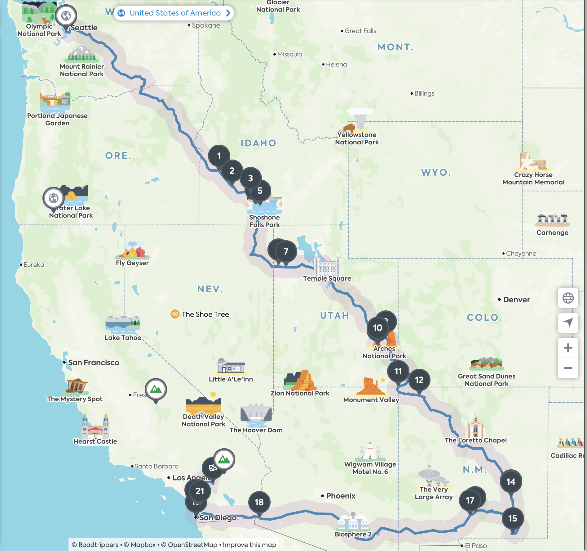
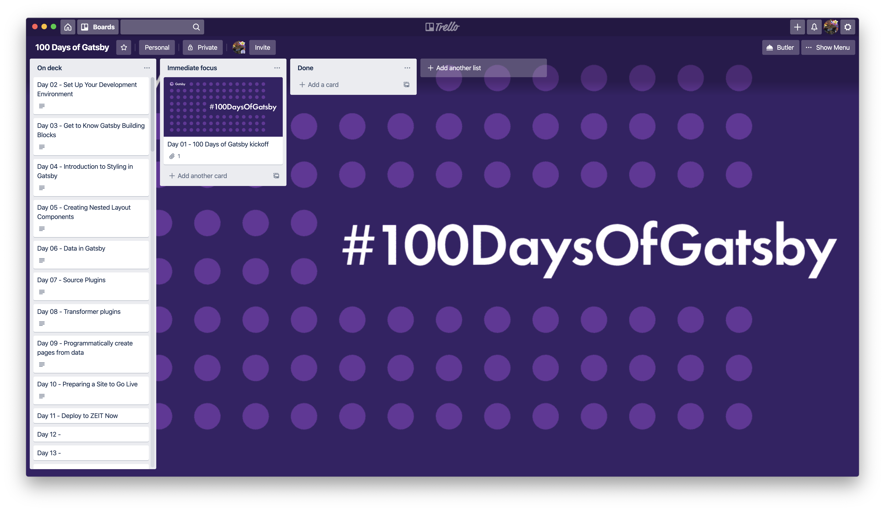

# Day 01 - Wednesday, January 1st, 2020

For the first week, Gatsby suggested exploring the [Gatsby.js Tutorials](https://www.gatsbyjs.org/tutorial/) and complete lessons 0-8.

I'm pretty stoked about committing to #100DaysOfGatsby - however my biggest challenge is that I am **3053.1** miles deep into a road trip:

Previously, I have dabbled around a bit with Gatsby - creating an example repo to develop Gatsby sites using [Docker](https://www.docker.com/) at [https://github.com/TheRobBrennan/explore-docker-gatsby](https://github.com/TheRobBrennan/explore-docker-gatsby)

Given that I will be on the road over the next few days, my goals are to review the [suggested Gatsby.js lessons](https://www.gatsbyjs.org/tutorial/).

While I do have some experience working with Gatsby, this will help buy time on the road.

Tonight's accomplishment will have to be creating this document as well as a Trello board for tracking ideas and progress:

