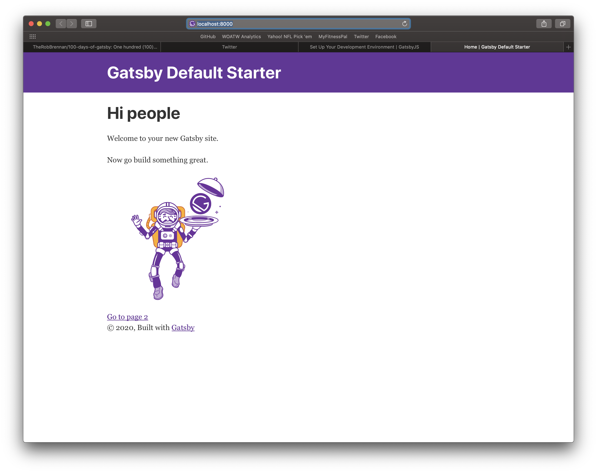
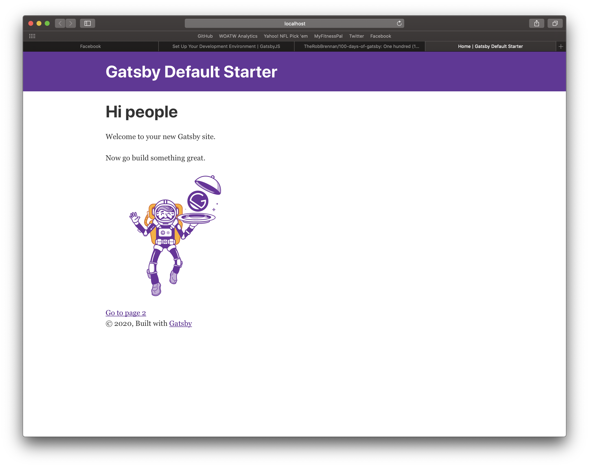
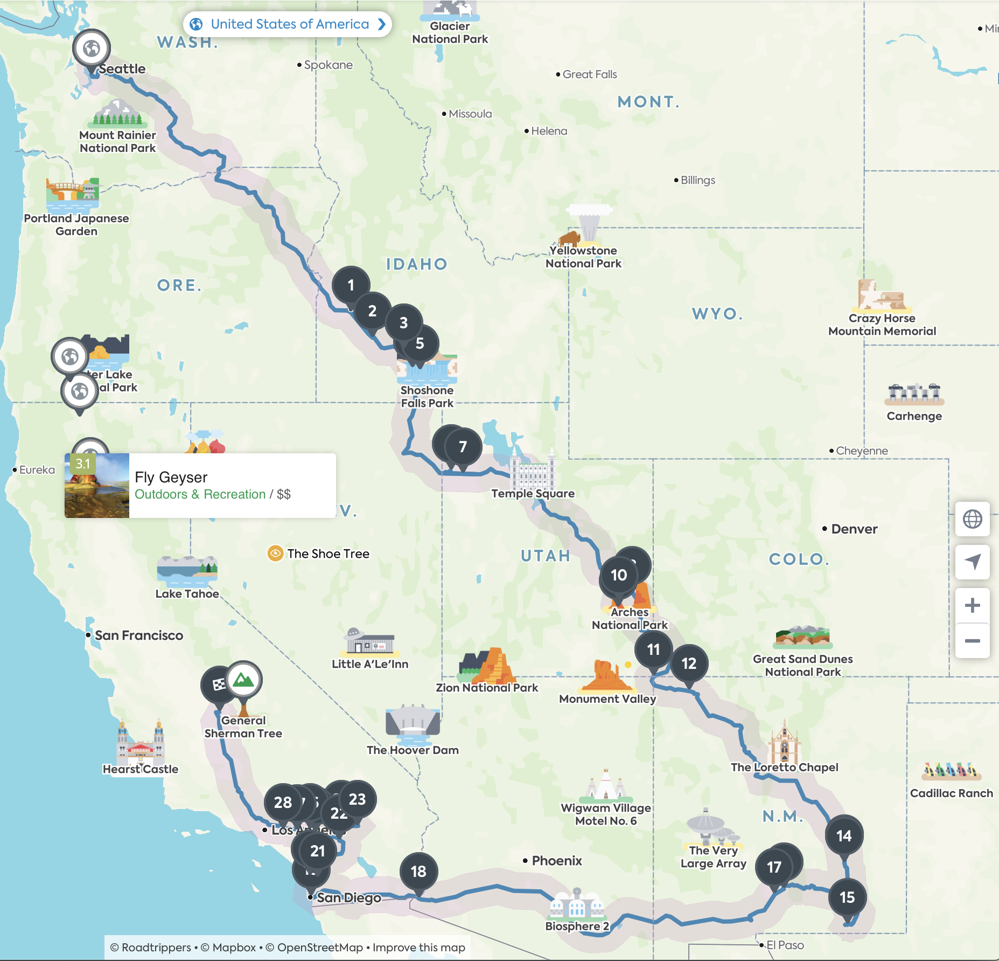

# Day 02 - Thursday, January 2nd, 2020

Today's focus is on the tutorial [Set Up Your Development Environment](https://www.gatsbyjs.org/tutorial/part-zero/).

As a personal preference, I love developing my applications using Docker. This enables me to ensure a consistent environment for development and release.

This example is intended to work with [Docker](https://www.docker.com) and a new app generated by the [Gatsby CLI](https://www.gatsbyjs.com).



```sh
# Navigate to the appropriate example directory
$ cd examples/day-02-gatsby-new

# Launch the Dockerized project
$ npm start # Or "npm run build"

You can now view gatsby-starter-default in the browser.
⠀
  Local:            http://localhost:8000/
  On Your Network:  http://172.20.0.2:8000/
⠀
View GraphiQL, an in-browser IDE, to explore your site\'s data and schema
⠀
  Local:            http://localhost:8000/___graphql
  On Your Network:  http://172.20.0.2:8000/___graphql
⠀
Note that the development build is not optimized.
```

The default Gatsby starter site should be available at [http://localhost:8000/](http://localhost:8000/):



When you are ready to spin down the Dockerized project, press CTRL+C and then...

```sh
$ npm stop

Removing gatsby-day-02 ... done
Removing network day-02-gatsby-new_default
```

Totally unrelated but worth noting...I am **3475.1** miles deep into a road trip:



## TL:DR Generate a new Gatsby site

To create a new Gatsby app, I will use `npx` to create a new [Gatsby](https://www.gatsbyjs.com) app using the latest version of the [Gatsby CLI](https://www.gatsbyjs.com):

```sh
# Navigate to the appropriate example directory
$ cd examples/day-02-gatsby-new

# Generate a new app using the latest version of the Gatsby CLI
$ npx gatsby new app
```
