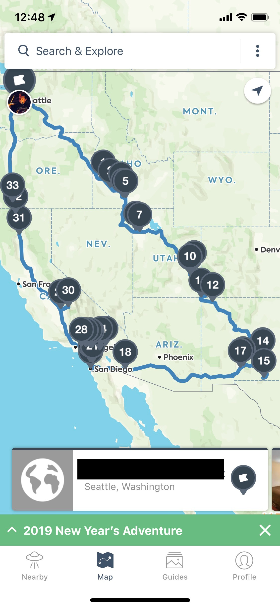
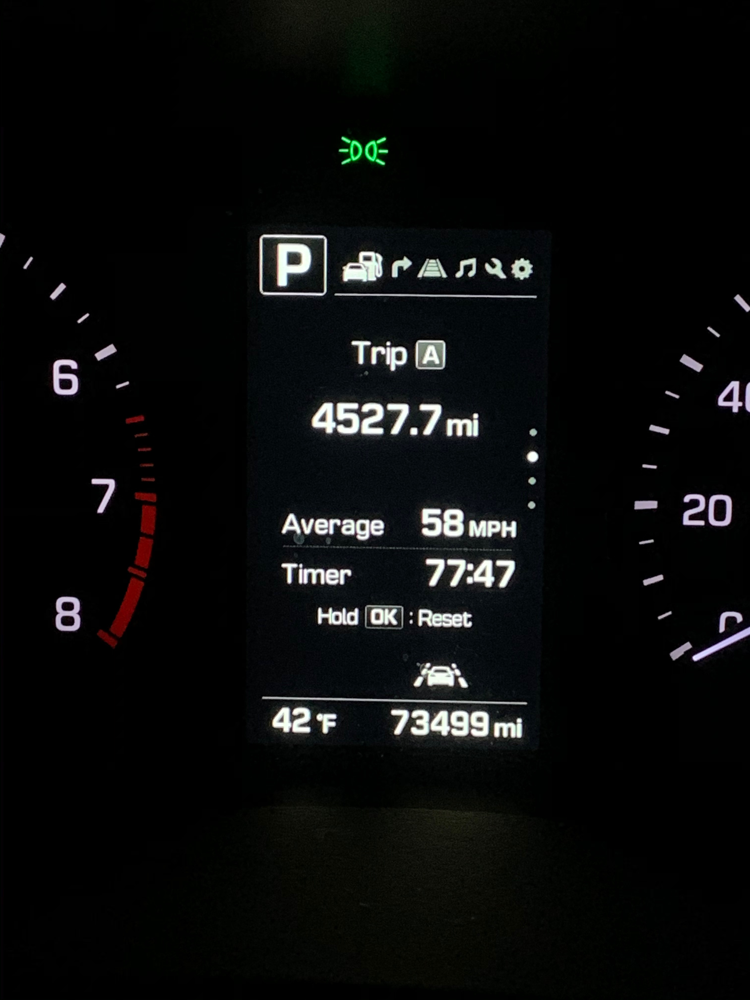

# Day 03 - Sunday, January 5th, 2020

Whew. You may have noticed a slight gap between day 02 and day 03. This was due to an unfortunate food poisoning experience toward the end of my road trip 😞 On the bright side, I have made it home safely - a total trip of **4527.7** miles in **ten days** - and am finally back to my usual self:





Today's focus is on the tutorial [Get to Know Gatsby Building Blocks](https://www.gatsbyjs.org/tutorial/part-one/).

## Scratchpad

To create a new Gatsby site using the URL of a Gatsby repo/starter:

```sh
$ npx gatsby new [SITE_DIRECTORY_NAME] [URL_OF_STARTER_GITHUB_REPO]
```

If you do not supply a URL to a starter, then Gatsby will create the app using the default.
