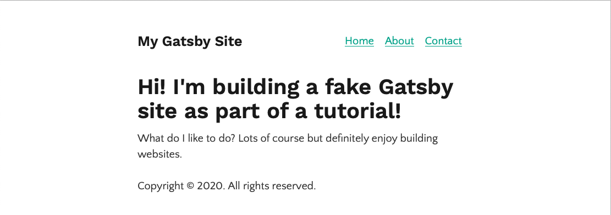
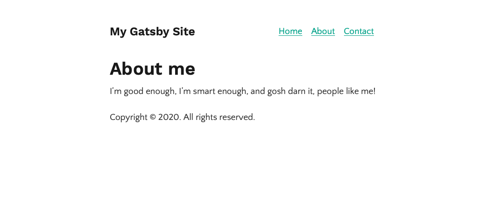
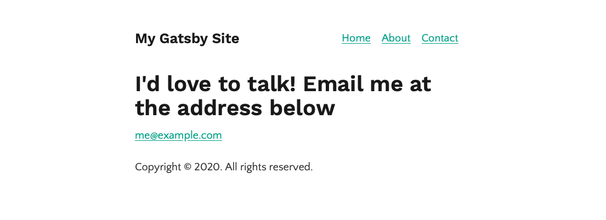

# Day 05 - Sunday, January 5th, 2020

Today's focus is on the tutorial [Creating Nested Layout Components](https://www.gatsbyjs.org/tutorial/part-three/):







## Scratchpad

Let's use the Gatsby "hello-world" starter for this example:

```sh
$ npx gatsby new app https://github.com/gatsbyjs/gatsby-starter-hello-world
```

Next, let's install and configure the `gatsby-plugin-typography` plugin:

```sh
$ npm install --save gatsby-plugin-typography react-typography typography typography-theme-fairy-gates
```
