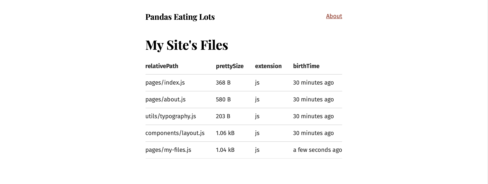

# Day 07 - Tuesday, January 7th, 2020

Today's focus is on the tutorial [Source Plugins](https://www.gatsbyjs.org/tutorial/part-five/).

[http://localhost:8000/my-files](http://localhost:8000/my-files)


As a side note, I've decided to go back to using Docker for my development after all. While aesthetically the output in the terminal may not be the greatest, it does prevent having to have many unnecessary `node_modules` folders installed. 🤓

## Scratchpad

This tutorial uses the site we created in `day-06` as the starting point:

```sh
# Copy the day 06 example to a new folder
$ cp -r 100-days-of-gatsby/day-06 100-days-of-gatsby/day-07
```

### Source plugins

Data in Gatsby sites can come from anywhere: APIs, databases, CMSs, local files, etc.

```sh
# Navigate to our app
$ cd app

# Install the source filesystem plugin
$ npm install --save gatsby-source-filesystem

# Modify gatsby-config.js
# View http://localhost:8000/___graphql and you should see allFile and file available in the Explorer

# Sample GraphQL query to view all files
# query MyQuery {
#   allFile {
#     edges {
#       node {
#         id
#         name
#       }
#     }
#   }
# }

# Create src/pages/my-files.js

```
