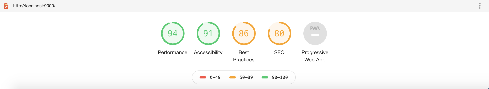

# Day 10 - Friday, January 10th, 2020

Today's focus is on the tutorial [Preparing a Site to Go Live](https://www.gatsbyjs.org/tutorial/part-eight/)

## Scratchpad

### Create a production build

```sh
# Build the production version
$ npx gatsby-cli build

# Serve the built app locally
$ npx gatsby-cli server

# Application should be available at http://localhost:9000
```

### Run a Lighthouse audit

When you run the Lighthouse audit initially, you will see something like:



From this, we can see that we have a poor Progressive Web App (PWA) score. Inclusion of a web app manifest is one of the three [generally accepted baseline requirements for a PWA](https://alistapart.com/article/yes-that-web-project-should-be-a-pwa#section1). Let's add a manifest file using the `gatsby-plugin-manifest` plugin.

Another requirement for PWAs is adding offline support by having a service worker run in the background. To enable this functionality, we will use the `gatsby-plugin-offline` plugin.

Next, we want to add page metadata using `react-helmet` and the `gatsby-plugin-react-helmet`
