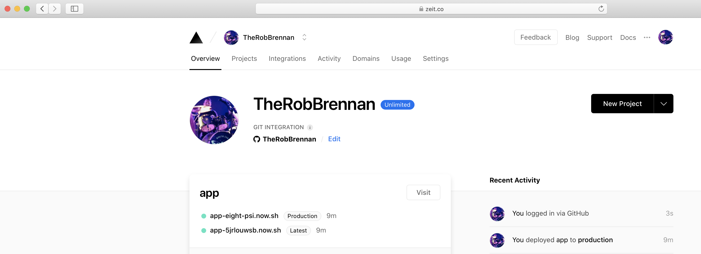

# Day 13 - Monday, January 13th, 2020

Today's task will be to simply generate a new site using the Gatsby CLI and deploy it to my favorite static and [JAMstack](https://jamstack.org) host - [ZEIT Now](https://zeit.co).

## Scratchpad

```sh
# Make sure we've navigated to our directory
$ cd 100-days-of-gatsby/day-13

# Generate a new Gatsby project
$ npx gatsby-cli new app

# [OPTIONAL] Modify the placeholder content

# Run the deploy script
$ npm run deploy
> day-13@0.0.0 deploy /Users/rob/repos/100-days-of-gatsby/100-days-of-gatsby/day-13
> cd app && npm run deploy


> gatsby-starter-default@0.1.0 deploy /Users/rob/repos/100-days-of-gatsby/100-days-of-gatsby/day-13/app
> npm run deploy:zeit-now


> gatsby-starter-default@0.1.0 deploy:zeit-now /Users/rob/repos/100-days-of-gatsby/100-days-of-gatsby/day-13/app
> now

> Deploying ~/repos/100-days-of-gatsby/100-days-of-gatsby/day-13/app under therobbrennan
> Using project app
> NOTE: Deployed to production. Run `now --prod` to overwrite later (https://zeit.ink/2F).
> Synced 2 files [3s]
> https://app-5jrlouwsb.now.sh [3s]
> Ready! Deployment complete [56s]
- https://app-eight-psi.now.sh
- https://app.therobbrennan.now.sh [in clipboard]
```

We can see that my default site is available at [https://app.therobbrennan.now.sh](https://app.therobbrennan.now.sh) - complete with a secured HTTPS deployment and publicly available URL:





Note that for this deployment, I'm not even concerned about creating a `now.json` configuration file to define a custom project name or alias. This is just a short and sweet example of how easy it is.
