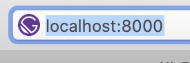
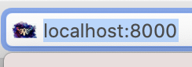

# Day 14 - Wednesday, January 15th, 2020

Today's focus is on adding a favicon to the default app generated by the Gatsby CLI.

Before:



After:



## Scratchpad

To create a new Gatsby app, I will use `npx` to create a new [Gatsby](https://www.gatsbyjs.com) app using the latest version of the [Gatsby CLI](https://www.gatsbyjs.com):

```sh
# Navigate to the appropriate example directory
$ cd examples/day-15

# Generate a new app using the latest version of the Gatsby CLI
$ npx gatsby new app

# Navigate to the app directory
$ cd app

# Install the gatsby-plugin-manifest plugin
$ npm i gatsby-plugin-manifest

# Modify gatsby-config.js to use the favicon supplied at src/images/favicon.png
```
