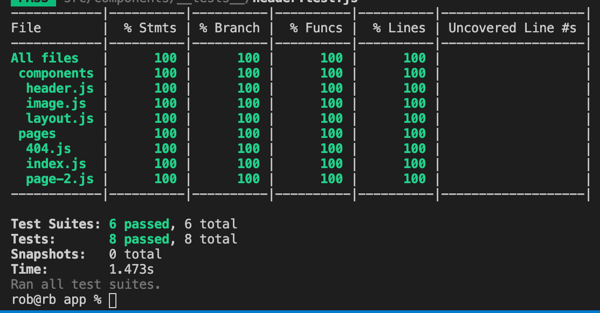
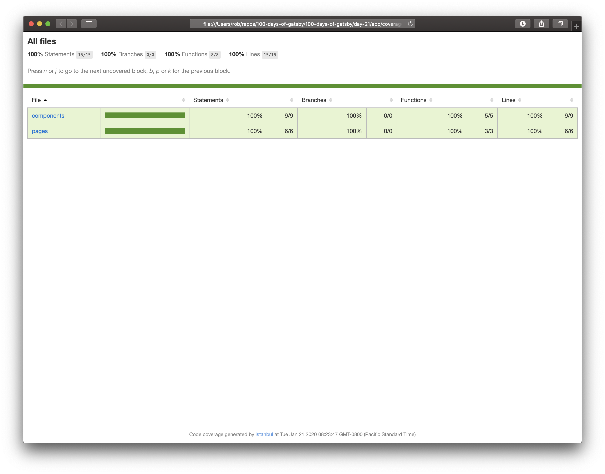

# Day 21 - Tuesday, January 21st, 2020

Today's focus is on incorporating [Jest](https://jestjs.io) into a Gatsby project for automated unit and integration testing.

Let's take a look at the official example from Gatsby at [https://github.com/gatsbyjs/gatsby/tree/master/examples/using-jest](https://github.com/gatsbyjs/gatsby/tree/master/examples/using-jest).

As an added bonus, I've added a `test:coverage` script to generate a code coverage report (100% coverage as of this writing) as well as automatically open a web browser to the generated report to review our test coverage 🤓





## Scratchpad

To create a new Gatsby app, I will use `npx` to create a new [Gatsby](https://www.gatsbyjs.com) app using the latest version of the [Gatsby CLI](https://www.gatsbyjs.com):

```sh
# Generate a new app using the latest version of the Gatsby CLI
$ npx gatsby new app
  # OPTIONAL: Copy the Dockerized Gatsby CLI example to an appropriate folder for a faster starting point
  $ cp -r 100-days-of-gatsby/default-gatsby-cli-app-dockerized 100-days-of-gatsby/day-##

# Navigate to the appropriate example directory
$ cd 100-days-of-gatsby/day-##

# Navigate to the app directory
$ cd app
```

## Ready?

Using the official example from Gatsby as a guide, we can see we need to install the following dev dependencies:

```json
  "devDependencies": {
    "@testing-library/jest-dom": "^4.0.0",
    "@testing-library/react": "^9.1.1",
    "babel-jest": "^24.0.0",
    "babel-preset-gatsby": "^0.1.6",
    "identity-obj-proxy": "^3.0.0",
    "jest": "^24.0.0"
  },
```

I'm going to see what happens installing the latest versions of these `devDependencies`.

```sh
# Install Jest
$ npm i -D jest

# Install Babel dependencies
$ npm i -D babel-jest babel-preset-gatsby
```

Oh snap! I received an error trying to install those Babel dependencies:

```sh
rob@rb app % npm i -D babel-jest babel-preset-gatsby
npm WARN tsutils@3.17.1 requires a peer of typescript@>=2.8.0 || >= 3.2.0-dev || >= 3.3.0-dev || >= 3.4.0-dev || >= 3.5.0-dev || >= 3.6.0-dev || >= 3.6.0-beta || >= 3.7.0-dev || >= 3.7.0-beta but none is installed. You must install peer dependencies yourself.

npm ERR! code EEXIST
npm ERR! path /Users/rob/repos/100-days-of-gatsby/100-days-of-gatsby/day-21/app/node_modules/.bin/regjsparser
npm ERR! Refusing to delete /Users/rob/repos/100-days-of-gatsby/100-days-of-gatsby/day-21/app/node_modules/.bin/regjsparser: is outside /Users/rob/repos/100-days-of-gatsby/100-days-of-gatsby/day-21/app/node_modules/regjsparser and not a link
npm ERR! File exists: /Users/rob/repos/100-days-of-gatsby/100-days-of-gatsby/day-21/app/node_modules/.bin/regjsparser
npm ERR! Remove the existing file and try again, or run npm
npm ERR! with --force to overwrite files recklessly.

npm ERR! A complete log of this run can be found in:
npm ERR!     /Users/rob/.npm/_logs/2020-01-21T15_50_58_022Z-debug.log
```

So...Let's see how we can fix this:

```sh
# Install TypeScript as a peer dependency of the Babel plugins
$ npm install typescript

# Remove node_modules folder from the local install
$ rm -rf node_modules/

# Install all dependencies
$ npm install

# Now let's try installing those Babel dependencies
$ npm i -D babel-jest babel-preset-gatsby
```

Success! We are back on track.

```sh
# Install the testing library dependencies
$ npm i -D @testing-library/jest-dom @testing-library/react

# Install the identity object proxy
$ npm i -D identity-obj-proxy
```

At this point, we have Jest configured as advised by the example Gatsby repo. Let's add a `test` script to `package.json` and give it a whirl:

```sh
ob@rb app % npm test

> gatsby-starter-default@0.1.0 test /Users/rob/repos/100-days-of-gatsby/100-days-of-gatsby/day-21/app
> jest

No tests found, exiting with code 1
Run with `--passWithNoTests` to exit with code 0
In /Users/rob/repos/100-days-of-gatsby/100-days-of-gatsby/day-21/app
  106 files checked.
  testMatch: **/__tests__/**/*.[jt]s?(x), **/?(*.)+(spec|test).[tj]s?(x) - 7 matches
  testPathIgnorePatterns: node_modules, .cache - 26 matches
  testRegex:  - 0 matches
Pattern:  - 0 matches
npm ERR! Test failed.  See above for more details.
```

Excellent. No tests have been found. Let's replace our `src/pages` and `src/components` folders with the example from the Gatsby repo:

```sh
$ npm test

> gatsby-starter-default@0.1.0 test /Users/rob/repos/100-days-of-gatsby/100-days-of-gatsby/day-21/app
> jest

 PASS  src/components/__tests__/header.test.js
 PASS  src/components/__tests__/image.test.js
 PASS  src/components/__tests__/layout.test.js
  ● Console

    console.warn node_modules/react-dom/cjs/react-dom.development.js:12357
      Warning: componentWillMount has been renamed, and is not recommended for use. See https://fb.me/react-unsafe-component-lifecycles for details.
      
      * Move code with side effects to componentDidMount, and set initial state in the constructor.
      * Rename componentWillMount to UNSAFE_componentWillMount to suppress this warning in non-strict mode. In React 17.x, only the UNSAFE_ name will work. To rename all deprecated
 lifecycles to their new names, you can run `npx react-codemod rename-unsafe-lifecycles` in your project source folder.
      
      Please update the following components: SideEffect(NullComponent)

 PASS  src/pages/__tests__/404.test.js
  ● Console

    console.warn node_modules/react-dom/cjs/react-dom.development.js:12357
      Warning: componentWillMount has been renamed, and is not recommended for use. See https://fb.me/react-unsafe-component-lifecycles for details.
      
      * Move code with side effects to componentDidMount, and set initial state in the constructor.
      * Rename componentWillMount to UNSAFE_componentWillMount to suppress this warning in non-strict mode. In React 17.x, only the UNSAFE_ name will work. To rename all deprecated
 lifecycles to their new names, you can run `npx react-codemod rename-unsafe-lifecycles` in your project source folder.
      
      Please update the following components: SideEffect(NullComponent)

 PASS  src/pages/__tests__/page-2.test.js
  ● Console

    console.warn node_modules/react-dom/cjs/react-dom.development.js:12357
      Warning: componentWillMount has been renamed, and is not recommended for use. See https://fb.me/react-unsafe-component-lifecycles for details.
      
      * Move code with side effects to componentDidMount, and set initial state in the constructor.
      * Rename componentWillMount to UNSAFE_componentWillMount to suppress this warning in non-strict mode. In React 17.x, only the UNSAFE_ name will work. To rename all deprecated
 lifecycles to their new names, you can run `npx react-codemod rename-unsafe-lifecycles` in your project source folder.
      
      Please update the following components: SideEffect(NullComponent)

 PASS  src/pages/__tests__/index.test.js
  ● Console

    console.warn node_modules/react-dom/cjs/react-dom.development.js:12357
      Warning: componentWillMount has been renamed, and is not recommended for use. See https://fb.me/react-unsafe-component-lifecycles for details.
      
      * Move code with side effects to componentDidMount, and set initial state in the constructor.
      * Rename componentWillMount to UNSAFE_componentWillMount to suppress this warning in non-strict mode. In React 17.x, only the UNSAFE_ name will work. To rename all deprecated
 lifecycles to their new names, you can run `npx react-codemod rename-unsafe-lifecycles` in your project source folder.
      
      Please update the following components: SideEffect(NullComponent)


Test Suites: 6 passed, 6 total
Tests:       8 passed, 8 total
Snapshots:   0 total
Time:        4.538s
Ran all test suites.
```

Success. Jest has been configured for our project and we have passing tests 💯
