# Day 23 - Thursday, January 23rd, 2020

After experiencing some surprising behavior with writing tests for the simple app I created yesterday, I wanted to really dive into what some of the gotchas were.

Ultimately I'd love to incorporate this into a blog post at some point, but currently there are way too many other pressing priorities to give that draft an estimated timeline.

## Thinking out loud

First, let's verify that our app is in a happy state.

After you have started the application, open a terminal window so that you can run Jest in watch mode:

```sh
$ npm run test:watch
```

Assuming you have started the application, please visit [http://localhost:8000](http://localhost:8000) and inspect the link `View the source`.

You should see something like:

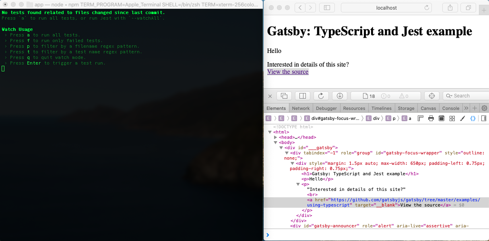

## Time to get our hands dirty

OK. Let's see what happens when we start from a naive implementation of this default page with the following implementation:

+ Our `IndexPage` component contains a Gatsby GraphQL page query to supply it with the `siteName` from the Gatsby config metadata
+ Our `IndexPage` component contains a `Source` component that uses a Gatsby GraphQL static query to supply it the URL of a GitHub repo

### Example 1: Mock the page query

For this example, we're going to tweak the `IndexPage` so that it appears as follows:

```jsx
// src/pages/index.tsx
import { graphql } from "gatsby"
import * as React from "react"
import Layout from "../components/layout"

// Please note that you can use https://github.com/dotansimha/graphql-code-generator
// to generate all types from graphQL schema
interface IndexPageProps {
  data: {
    site: {
      siteMetadata: {
        siteName: string,
      }
    }
  }
}

export const pageQuery = graphql`
  query IndexQuery {
    site {
      siteMetadata {
        siteName
      }
    }
  }
`

export default class IndexPage extends React.Component<IndexPageProps> {
  readonly hello = `Hello`
  public render() {
    // Add logging to see what data is getting passed in
    console.log(`this.props.data: ${JSON.stringify(this.props.data, null, 2)}`)

    const { siteName } = this.props.data.site.siteMetadata
    return (
      <Layout>
        <h1>{siteName}</h1>
        <p>
          {this.hello}.
        </p>
      </Layout>
    )
  }
}
```

If we open our dev tools in our browser, we should see that we are getting our metadata from `gatsby-config.js`:

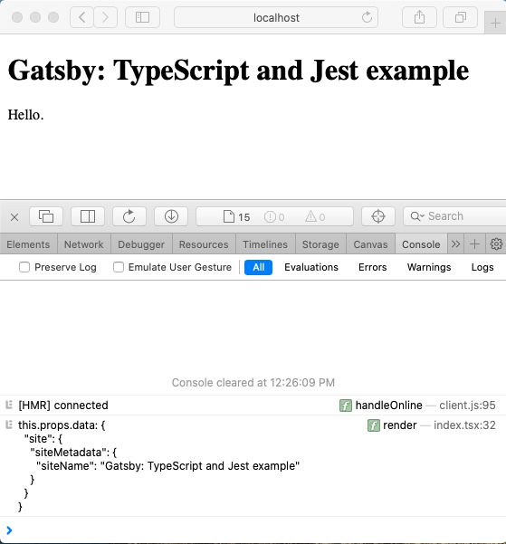

Next, we'll want to create a test for this page and make sure that we mock out the GraphQL page query response. Remember - Gatsby will build our pages and inject the GraphQL data where appropriate. In a test environment, we do not have the page with rendered GraphQL data. We must supply it ourselves:

```jsx
// src/pages/index.test.tsx
import React from 'react'
import { render } from '@testing-library/react'

import Index from './index'

describe(`IndexPage`, () => {
  it(`contains a greeting`, () => {
    // Create mock data here. IndexPage will have the result of pageQuery available as this.props.data;
    // we can simulate that GraphQL response here by passing in an explicit data prop
    const mockPageQuery = {
      site: {
        siteMetadata: {
          siteName: 'Using Jest to mock GraphQL',
          exampleUrl: 'https://myfakesite.com',
        }
      }
    }
    const { getByText } = render(<Index data={mockPageQuery} />)

    const greeting = getByText(/Hello/)
    expect(greeting).toBeInTheDocument()

  })
})
```

To verify this is working properly, take a peek at both the test output as well as the console logs in your browser:

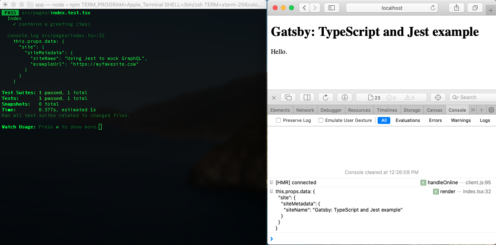

Notice how we are explicitly passing our `mockPageQuery` as a `data` prop to our `IndexPage` component. This gives us the exact shape and sample data that our `IndexPage` component receives from the GraphQL data injected by Gatsby.

Why?

Let's see what happens when we modify our test file to this:

```jsx
    const { getByText } = render(<Index />)
```

Notice how our use of TypeScript here allows VS Code to scream loudly at us that we have a problem:

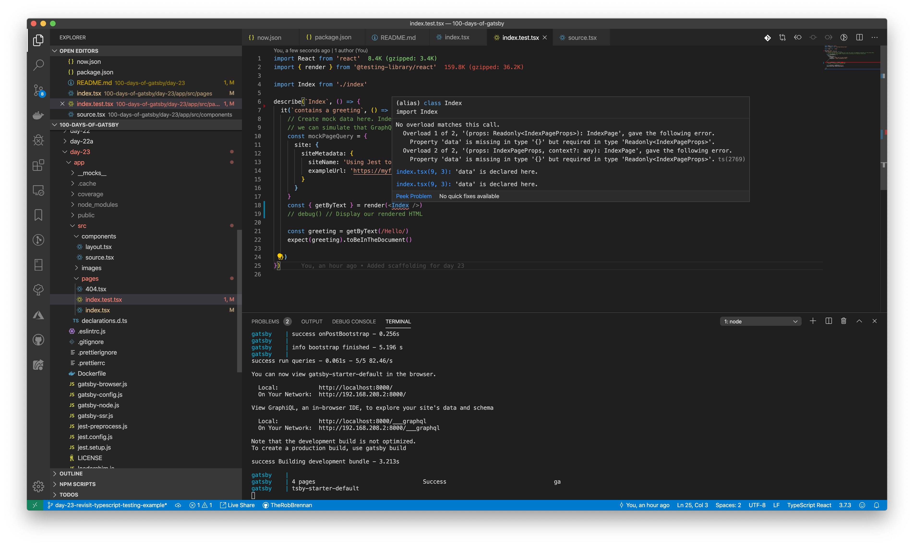

We're going to be bad engineers and ignore this warning to see what happens:

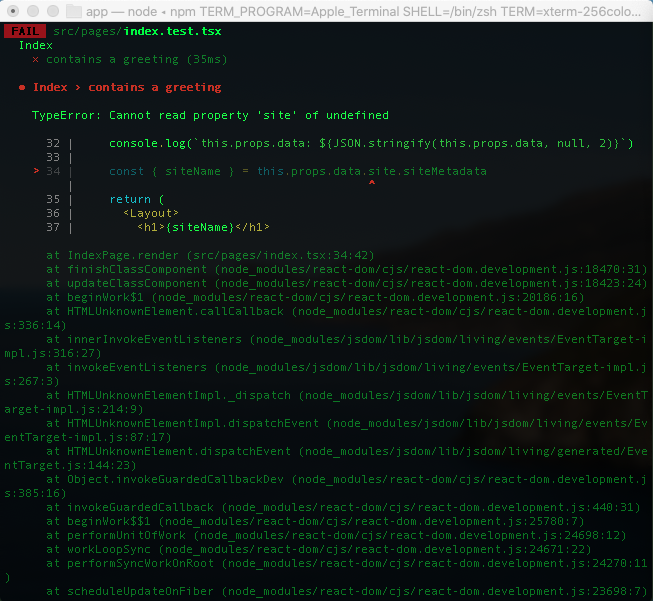

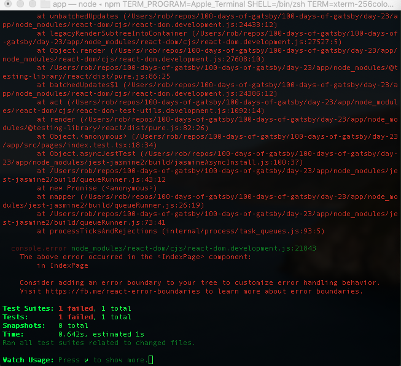

Sure enough, our test fails because we do not have any data passed into `IndexPage` - however, our Gatsby page still renders as expected with the GraphQL data it has been supplied with:

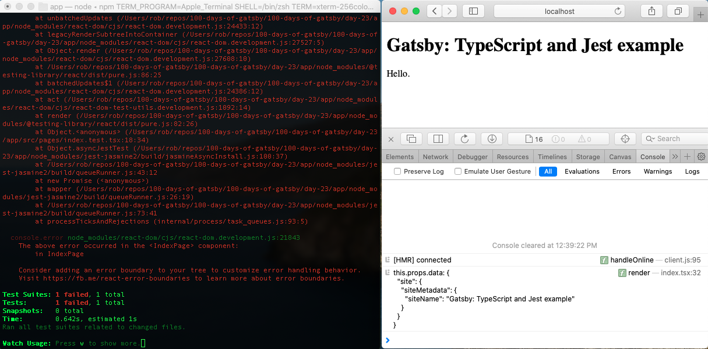

Let's fix our test and verify that our `IndexPage` component is receiving data correctly from our test as well as from Gatsby:

```jsx
// src/pages/index.test.tsx
import React from 'react'
import { render } from '@testing-library/react'

import Index from './index'

describe(`IndexPage`, () => {
  it(`contains a greeting`, () => {
    // Create mock data here. IndexPage will have the result of pageQuery available as this.props.data;
    // we can simulate that GraphQL response here by passing in an explicit data prop
    const mockPageQuery = {
      site: {
        siteMetadata: {
          siteName: 'Using Jest to mock GraphQL',
          exampleUrl: 'https://myfakesite.com',
        }
      }
    }
    const { getByText } = render(<Index data={mockPageQuery} />)

    const greeting = getByText(/Hello/)
    expect(greeting).toBeInTheDocument()

  })
})
```

Congratulations. You have just learned how to mock GraphQL data for your Gatsby pages...er, your Gatsby pages that contain components that do not rely upon GraphQL data being supplied from a static query.

Let's look at the next example to see why.

### Example 2: Introduce the Source component

Let's take a look at an example component that will use a static query for Gatsby to inject data.

When reviewing the code for the `Source` component, please note the following:

+ We are using a static query to inject GraphQL data into our component
+ We have created a `PureSourceComponent` so that a future `source.test.tsx` file can test the component with data independently - without relying upon external dependencies such as our GraphQL data
+ We have made minor changes to logging statements to clearly identify data supplied to the `IndexPage` component and data supplied to the `Source` component

```jsx
import React, { ReactElement } from "react"
import { graphql, useStaticQuery } from "gatsby"

const defaultProps = {
  linkText: `View the source`,
}

type SourceProps = { description: string, data?: any } & typeof defaultProps

type UrlProps = {
  site: {
    siteMetadata: {
      exampleUrl: string
    }
  }
}

type PureComponentProps = {
  description: string,
  linkText: string,
  data?: any,
}

// TIP: Create a PureComponent for testing purposes
// TODO: Write a separate source.test.tsx file to test the pure component
export const PureSourceComponent = ({ data, description, linkText }: PureComponentProps) => {
  const href = (data && data.site.siteMetadata.exampleUrl)
  const target = (href && '__blank')

  return (
    <>
      <p>
        {description} <br /> <a href={href} target={target}>{linkText}</a>
      </p>
    </>
  )
}

const Source = (props: SourceProps): ReactElement => {
  const data = useStaticQuery<UrlProps>(graphql`
    query {
      site {
        siteMetadata {
          exampleUrl
        }
      }
    }
  `)

  // Add logging to see what data is getting passed in
  console.log(`Source data: ${JSON.stringify(data, null, 2)}`)
  console.log(`Source props.data: ${JSON.stringify(props.data, null, 2)}`)

  return (
    <PureSourceComponent {...props} />
  )
}

export default Source

Source.defaultProps = defaultProps
```

If we look at our browser console, we can see that we have received the `exampleUrl` from our Gatsby site metadata. Our test suite, however, shows that we do not have any data to work with:

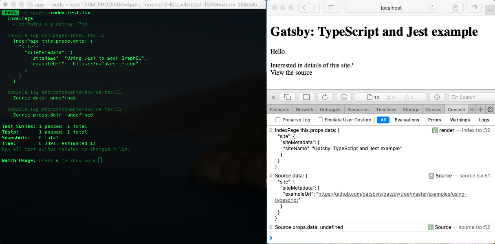

What?

This is correct. Remember in our first example that we need to generate a mock GraphQL response for our page query. So...What do we need to do to make this component work?

Let's use the spread syntax and pass our props from the `IndexPage` component to our `Source` component:

```jsx
// src/pages/index.tsx
// ...
export default class IndexPage extends React.Component<IndexPageProps> {
  readonly hello = `Hello`
  public render() {
    // Add logging to see what data is getting passed in
    console.log(`IndexPage this.props.data: ${JSON.stringify(this.props.data, null, 2)}`)

    const { siteName } = this.props.data.site.siteMetadata
    return (
      <Layout>
        <h1>{siteName}</h1>
        <p>
          {this.hello}.
        </p>
        <Source description="Interested in details of this site?" {...this.props} />
      </Layout>
    )
  }
}
```

Notice how our test (on the left) does not have data from Gatsby's GraphQL static query, but it does contain the mock GraphQL data we defined in `mockPageQuery`. For our Gatsby page on the right, we can see that the `Source` component **does** receive data from GraphQL - as well as data from GraphQL that was injected when the `IndexPage` was built:

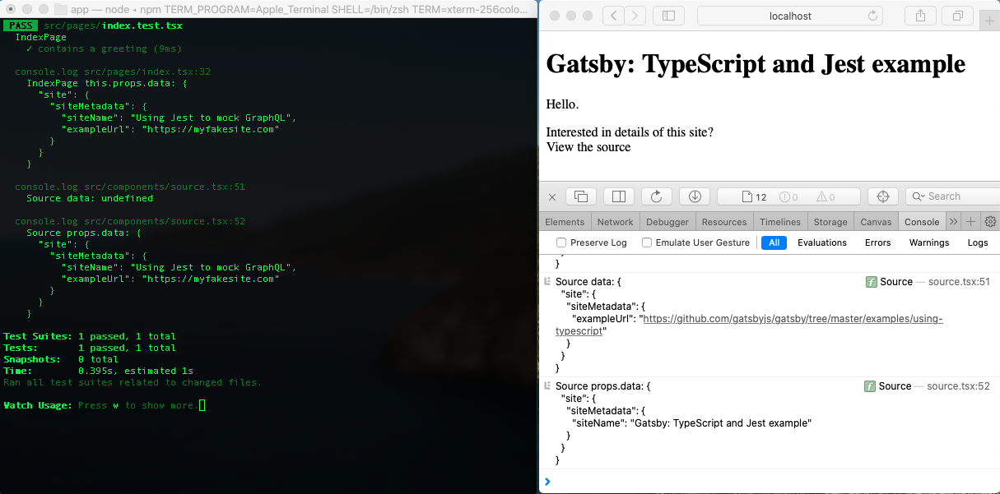

Let's look at one more thing. Did you notice that our test output shows that we have a data shape for `Source props.data` that does not match the `Source props.data` output we see in the browser console log?

This might be a moment where you find yourself scratching your head.

Let's think about what's going on here. We defined mock GraphQL data that we supplied to the `IndexPage` in our test. The `IndexPage` component is passing its props through to the `Source` component. The `Source` component actually passes these props to the `PureSourceComponent` so that whatever data is presented will be displayed.

One more thing. Did you also notice that we have lost our hyperlink for `View the source` in the HTML rendered for the Gatsby page? Oh dear.

Let's modify our test so that we can see what HTML is being rendered by the component:

```jsx
// src/pages/index.test.jsx
import React from 'react'
import { render } from '@testing-library/react'

import Index from './index'

describe(`IndexPage`, () => {
  it(`contains a greeting`, () => {
    // Create mock data here. IndexPage will have the result of pageQuery available as this.props.data;
    // we can simulate that GraphQL response here by passing in an explicit data prop
    const mockPageQuery = {
      site: {
        siteMetadata: {
          siteName: 'Using Jest to mock GraphQL',
          exampleUrl: 'https://myfakesite.com',
        }
      }
    }
    const { getByText, debug } = render(<Index data={mockPageQuery} />)
    debug() // Display our rendered HTML

    const greeting = getByText(/Hello/)
    expect(greeting).toBeInTheDocument()

  })
})
```

We can see that our test is showing a component that renders the hyperlink for `View the source` with our `https://myfakesite.com` mock data, however the actual Gatsby rendered page does not have a hyperlink for `View the source`:


Let's fix this.

In our `Source` component, let's pass in all of the props first and then use the response from our Gatsby GraphQL static query - `data` - or use `props.data` passed in from our parent component:


```jsx
// src/components/source.tsx
// ...
const Source = (props: SourceProps): ReactElement => {
  const data = useStaticQuery<UrlProps>(graphql`
    query {
      site {
        siteMetadata {
          exampleUrl
        }
      }
    }
  `)

  // Add logging to see what data is getting passed in
  console.log(`Source data: ${JSON.stringify(data, null, 2)}`)
  console.log(`Source props.data: ${JSON.stringify(props.data, null, 2)}`)

  // Note that we are explicitly passing in a data prop to our PureSourceComponent
  //  WHY? We want our component to use data generated from the static query in a live Gatsby app;
  //  however if that is undefined it means we are in a testing environment and need to supply our data.
  //
  // In the case of this Source component - which we are incorporating into our index page - the index page
  // test will fail because the mock query result that we sent to it will not automatically get passed down
  // to children components.
  return (
    <PureSourceComponent {...props} data={data || props.data} />
  )
}

export default Source

Source.defaultProps = defaultProps
```

Tada! 🎩 Our `Source` component now receives data from either the Gatsby GraphQL static query or the data from its parent component:

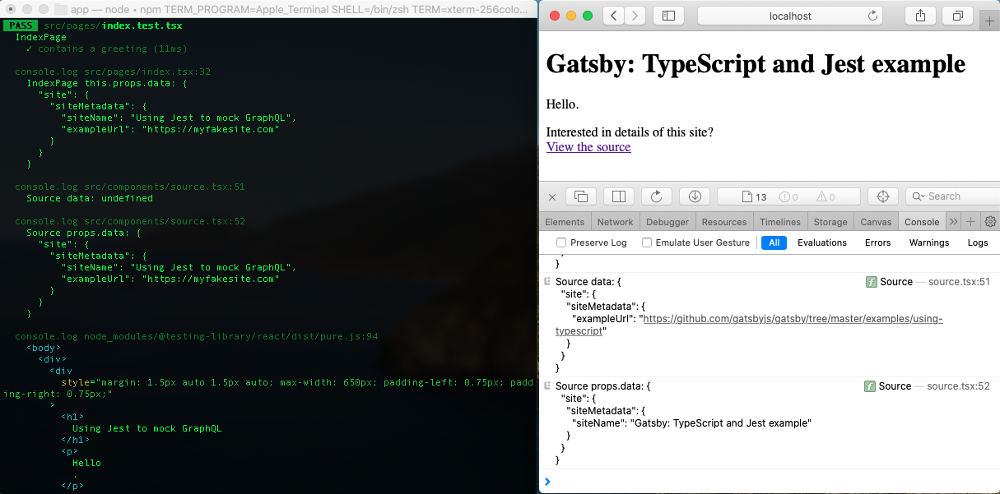

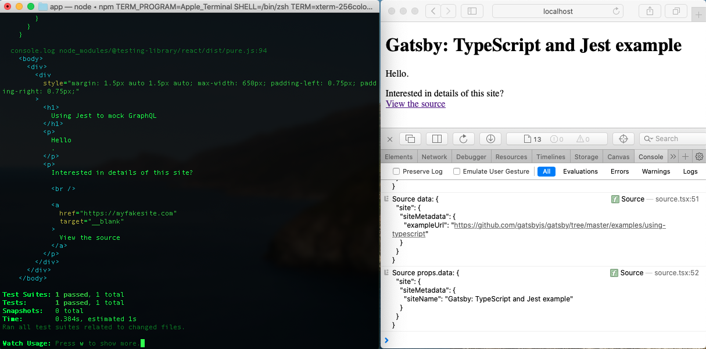

...and now we can rest easy. Our tests pass for the `IndexPage`, and our live site actually does display an external link to a GitHub repo as expected.
