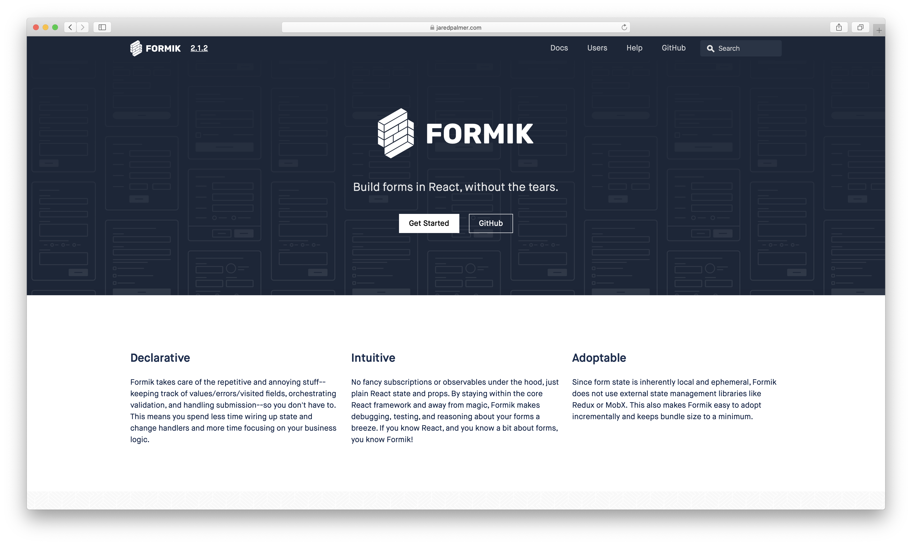

# Day 26 - Sunday, January 26th, 2020

Today's focus is on exploring [Formik](https://jaredpalmer.com/formik) for building forms in React:



## Scratchpad

To create a new Gatsby app, I will use `npx` to create a new [Gatsby](https://www.gatsbyjs.com) app using the latest version of the [Gatsby CLI](https://www.gatsbyjs.com):

```sh
# Generate a new app using the latest version of the Gatsby CLI
$ npx gatsby new app
  # OPTIONAL: Copy the Dockerized Gatsby CLI example to an appropriate folder for a faster starting point
  $ cp -r 100-days-of-gatsby/default-gatsby-cli-app-dockerized 100-days-of-gatsby/day-##

# Navigate to the appropriate example directory
$ cd 100-days-of-gatsby/day-##

# Navigate to the app directory
$ cd app
```

## Getting started

For this example, we're going to need to install the `formik` module to our app:

```sh
# Navigate to our app
$ cd 100-days-of-gatsby/day-26/app

# Add our formik dependency
$ npm i formik
```

### Formik tutorial

First, let's review [The Basics](https://jaredpalmer.com/formik/docs/tutorial#the-basics) tutorial.

#### Simple form with a single field

We'll start by creating a simple form component at creating `app/src/components/forms/simple-form-1.js`

#### Simple form with several fields

Let's add a `firstName` and `lastName` field - we'll build on the previous example by creating `app/src/components/forms/simple-form-1.js`

As the tutorial mentions, we should notice the following patterns and symmetry:

+ We reuse the same exact change handler function `handleChange` for each HTML input.
+ We pass an `id` and `name` HTML attribute that matches the property we defined in `initialValues`
+ We access the field's value using the same name (`email` -> `formik.values.email`).

If you're familiar with building forms with plain React, you can think of Formik's handleChange as working like this:

```js
const [values, setValues] = React.useState({});

const handleChange = event => {
  setValues(prevValues => ({
    ...prevValues,
    // we use the name to tell formik which key of `values` to update.
    [event.target.name]: event.target.value
  });
}
```

#### Simple form with validation

This example is `app/src/components/forms/simple-form-3.js`

Next, we'll want to add some validation to our form. Formik keeps track of not only your form's values, but also its error messages and validation. To add validation with JS, let's specify a custom validation function and pass it as `validate` to the `useFormik()` hook. If an error exists, this custom validation function should produce an error object with a matching shape to our `values`/`initialValues`. Again...symmetry...yes...

`formik.errors` is populated via the custom validation function. By default, Formik will validate after each keystroke (change event), each input's blur event, as well as prior to submission. It will only proceed with executing the `onSubmit` function we passed to `useFormik()` if there are no errors (i.e. if our validation function returned {}).

#### Simple form with visited fields

This example is `app/src/components/forms/simple-form-4.js`

While our form works, and our users see each error, it's not a great user experience for them. Since our validation function runs on **each keystroke** against the entire form's `values`, our `errors` object contains _all_ validation errors at any given moment. In our component, we are just checking if an error exists and then immediately showing it to the user. This is awkward since we're going to show error messages for fields that the user hasn't even visited yet. Most of the time, we only want to show a field's error message after our user is done typing in that field.

Like `errors` and `values`, Formik can keep track of which fields have been visited. It stores this information in an object called `touched` that also mirrors the shape of `values`/`initialValues`, but each key can only be a boolean `true`/`false`.

To take advantage of `touched`, we can pass `formik.handleBlur` to each input's `onBlur` prop. This function works similarly to `formik.handleChange` in that it uses the `name` attribute to figure out which field to update.

#### Simple form with schema validation with Yup

As you can see above, validation is left up to you. Feel free to write your own validators or use a 3rd-party helper library. Formik's authors/a large portion of its users use Jason Quense's library [Yup](https://github.com/jquense/yup) for object schema validation. [Yup](https://github.com/jquense/yup) has an API that's similar to Joi / React PropTypes but is also small enough for the browser and fast enough for runtime usage. You can try it out here with this REPL.

Since Formik authors/users love Yup so much, Formik has a special configuration option / prop for Yup called `validationSchema` which will automatically transform Yup's validation errors messages into a pretty object whose keys match `values`/`initialValues`/`touched` (just like any custom validation function would have to). Anyways, you can install Yup from NPM/yarn like so...

```sh
$ npm install yup
```

To see how Yup works, let's get rid of our custom validation function validate and re-write our validation with Yup and `validationSchema` as `100-days-of-gatsby/day-26/app/src/components/forms/simple-form-5-with-yup-schema-validation.js`

For comparison, here is our validate function in `SimpleForm4`:

```js
const validate = values => {
  const errors = {};
  if (!values.firstName) {
    errors.firstName = 'Required';
  } else if (values.firstName.length > 15) {
    errors.firstName = 'Must be 15 characters or less';
  }

  if (!values.lastName) {
    errors.lastName = 'Required';
  } else if (values.lastName.length > 20) {
    errors.lastName = 'Must be 20 characters or less';
  }

  if (!values.email) {
    errors.email = 'Required';
  } else if (!/^[A-Z0-9._%+-]+@[A-Z0-9.-]+\.[A-Z]{2,4}$/i.test(values.email)) {
    errors.email = 'Invalid email address';
  }

  return errors;
};
```

Here is our validation schema equivalent using Yup in `SimpleForm5`:

```js
validationSchema: Yup.object({
  firstName: Yup.string()
    .max(15, 'Must be 15 characters or less')
    .required('Required'),
  lastName: Yup.string()
    .max(20, 'Must be 20 characters or less')
    .required('Required'),
  email: Yup.string()
    .email('Invalid email address')
    .required('Required'),
}),
```

#### Simple form reducing boilerplate

##### getFieldProps()

The code above is very explicit about exactly what Formik is doing. `onChange` -> `handleChange`, `onBlur` -> `handleBlur`, and so on. However, to save you time, `useFormik()` returns a helper method called `formik.getFieldProps()` to make it faster to wire up inputs. Given some field-level info, it returns to you the exact group of onChange, onBlur, value, checked for a given field. You can then spread that on an input, select, or textarea.

Let's take a look at `app/src/components/forms/simple-form-6.js`

##### Leveraging React Context

Our code above is again very explicit about exactly what Formik is doing. `onChange` -> `handleChange`, `onBlur` -> `handleBlur`, and so on. However, we still have to manually pass each input this "prop getter" getFieldProps(). To save you even more time, Formik comes with React Context-powered API/component make life easier and less verbose: `<Formik />`, `<Form />`, `<Field />`, and `<ErrorMessage />`. More explicitly, they use React Context implicitly to connect to the parent `<Formik />` state/methods.

Since these components use React Context, we need to render a React Context Provider that holds our form state and helpers in our tree. If you did this yourself, it would look like:

```jsx
import React from 'react';
import { useFormik } from 'formik';

// Create empty context
const FormikContext = React.createContext({});

// Place all of what's returned by useFormik onto context
export const Formik = ({ children, ...props }) => {
  const formikStateAndHelpers = useFormik(props);
  return (
    <FormikContext.Provider value={formikStateAndHelpers}>
      {typeof children === 'function'
        ? children(formikStateAndHelpers)
        : children}
    </FormikContext.Provider>
  );
};
```

Luckily, we've done this for you and a `<Formik>` component that works just like this one comes with the package.

Let's now swap out the `useFormik()` hook for the Formik's `<Formik>` component/render-prop. Since it's a component, we'll convert the object passed to `useFormik()` to JSX, with each key becoming a prop.

Take a look at `app/src/components/forms/simple-form-7.js`

As you can see above, we swapped out `useFormik()` hook and replaced it with the `<Formik>` component. The `<Formik>` accepts a function as its children (a.k.a. a render prop). Its argument is the exact same object returned by `useFormik()` (in fact, `<Formik>` calls `useFormik()` internally!!). Thus, our form works the same as before, except now we can use new components to express ourselves in a more concise manner.

Take a look at `app/src/components/forms/simple-form-8.js`

The `<Field>` component by default will render an `<input>` component that given a name prop will implicitly grab the respective `onChange`, `onBlur`, `value` props and pass them to the element as well as any props you pass to it. However, since not everything is an input, `<Field>` also accepts a few other props to let you render whatever you want. Some examples..

```jsx
// <input className="form-input" placeHolder="Jane"  />
<Field name="firstName" className="form-input" placeholder="Jane" />

// <textarea className="form-textarea"/></textarea>
<Field name="message" as="textarea"  className="form-input"/>

// <select className="my-select"/>
<Field name="colors" as="select" className="my-select">
  <option value="red">Red</option>
  <option value="green">Green</option>
  <option value="blue">Blue</option>
</Field>

// with styled-components/emotion
const MyStyledInput = styled.input`
  padding: .5em;
  border: 1px solid #eee;
  /* ... */
`
const MyStyledTextarea = MyStyledInput.withComponent('textarea');

// <input className="czx_123" placeHolder="google.com"  />
<Field name="website" as={MyStyledInput} placeHolder="google.com"/>

// <textarea  placeHolder="Post a message..." rows={5}></textarea>
<Field name="message" as={MyStyledTextArea} placeHolder="Post a message.." rows={4}/>
```

###### One more thing

React is all about composition, and while we've cut down on a lot of the prop-drilling, we are still repeating ourselves with a `label`, `<Field>`, and `<ErrorMessage>` for each of our inputs. We can do better with an abstraction! With Formik, you can and should build reusable input primitive components that you can share around your application. Turns out our `<Field>` render-prop component has a sister and her name is useField that's going to do the same thing, but via React Hooks! Check this out...

```jsx
import React from 'react';
import { Formik, Form, useField } from 'formik';
import styled from '@emotion/styled';
import * as Yup from 'yup';

const MyTextInput = ({ label, ...props }) => {
  // useField() returns [formik.getFieldProps(), formik.getFieldMeta()]
  // which we can spread on <input> and also replace ErrorMessage entirely.
  const [field, meta] = useField(props);
  return (
    <>
      <label htmlFor={props.id || props.name}>{label}</label>
      <input className="text-input" {...field} {...props} />
      {meta.touched && meta.error ? (
        <div className="error">{meta.error}</div>
      ) : null}
    </>
  );
};

const MyCheckbox = ({ children, ...props }) => {
  // We need to tell useField what type of input this is
  // since React treats radios and checkboxes differently
  // than inputs/select/textarea.
  const [field, meta] = useField({ ...props, type: 'checkbox' });
  return (
    <>
      <label className="checkbox">
        <input type="checkbox" {...field} {...props} />
        {children}
      </label>
      {meta.touched && meta.error ? (
        <div className="error">{meta.error}</div>
      ) : null}
    </>
  );
};

// Styled components ....
const StyledSelect = styled.select`
  /** ... * /
`;

const StyledErrorMessage = styled.div`
  /** ... * /
`;

const StyledLabel = styled.label`
 /** ...* /
`;

const MySelect = ({ label, ...props }) => {
  const [field, meta] = useField(props);
  return (
    <>
      <StyledLabel htmlFor={props.id || props.name}>{label}</StyledLabel>
      <StyledSelect {...field} {...props} />
      {meta.touched && meta.error ? (
        <StyledErrorMessage>{meta.error}</StyledErrorMessage>
      ) : null}
    </>
  );
};

// And now we can use these
const SignupForm = () => {
  return (
    <>
      <h1>Subscribe!</h1>
      <Formik
        initialValues={{
          firstName: '',
          lastName: '',
          email: '',
          acceptedTerms: false, // added for our checkbox
          jobType: '', // added for our select
        }}
        validationSchema={Yup.object({
          firstName: Yup.string()
            .max(15, 'Must be 15 characters or less')
            .required('Required'),
          lastName: Yup.string()
            .max(20, 'Must be 20 characters or less')
            .required('Required'),
          email: Yup.string()
            .email('Invalid email address')
            .required('Required'),
          acceptedTerms: Yup.boolean()
            .required('Required')
            .oneOf([true], 'You must accept the terms and conditions.'),
          jobType: Yup.string()
            .oneOf(
              ['designer', 'development', 'product', 'other'],
              'Invalid Job Type'
            )
            .required('Required'),
        })}
        onSubmit={(values, { setSubmitting }) => {
          setTimeout(() => {
            alert(JSON.stringify(values, null, 2));
            setSubmitting(false);
          }, 400);
        }}
      >
        <Form>
          <MyTextInput
            label="First Name"
            name="firstName"
            type="text"
            placeholder="Jane"
          />
          <MyTextInput
            label="Last Name"
            name="lastName"
            type="text"
            placeholder="Doe"
          />
          <MyTextInput
            label="Email Address"
            name="email"
            type="email"
            placeholder="jane@formik.com"
          />
          <MySelect label="Job Type" name="jobType">
            <option value="">Select a job type</option>
            <option value="designer">Designer</option>
            <option value="development">Developer</option>
            <option value="product">Product Manager</option>
            <option value="other">Other</option>
          </MySelect>
          <MyCheckbox name="acceptedTerms">
            I accept the terms and conditions
          </MyCheckbox>

          <button type="submit">Submit</button>
        </Form>
      </Formik>
    </>
  );
};
```

Let's try the above code in `app/src/components/forms/simple-form-9.js` - after we add the `@emotion/core` and `@emotion/styled` modules to our app.

#### Wrapping up

Congratulations! You've created a signup form with Formik that:

+ Has complex validation logic and rich error messages
+ Properly displays errors messages to the user at the correct time (after they have blurred a field)
+ Leverages your own custom input components you can use on other forms in your app

Nice work! We hope you now feel like you have a decent grasp on how Formik works.

Check out the final result here: Final Result.

If you have extra time or want to practice your new Formik skills, here are some ideas for improvements that you could make to the signup form which are listed in order of increasing difficulty:

+ Disable the submit button while the user is attempted a submit (hint: `formik.isSubmitting`)
+ Add a reset button with `formik.handleReset` or `<button type="reset">`.
+ Prepopulate `initialValues` based on URL query string or props passed to `<SignupForm>`.
+ Change input border color to red when a field has an error and isn't focused
+ Add a shake animation to each field when it displays an error and has been visited
+ Persist form state to the browser's sessionStorage so that form progress is kept inbetween page refreshes

Throughout this tutorial, we touched on Formik concepts including form state, fields, validation, hooks, render props, and React context. For a more detailed explanation of each of these topics, check out the rest of the documentation. To learn more about defining the components and hooks in the tutorial, check out the API reference.

Feel free to review the [Resources](https://jaredpalmer.com/formik/docs/resources) available at [https://jaredpalmer.com/formik/docs/resources](https://jaredpalmer.com/formik/docs/resources)
