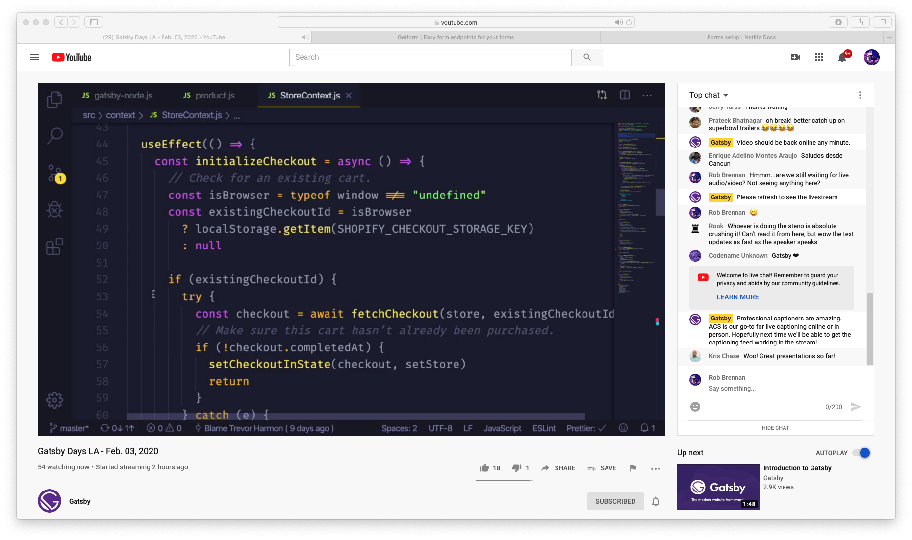

# Day 35 - Tuesday, February 4th, 2020

Today's focus is on reflecting on the [Gatsby Days LA](https://www.youtube.com/watch?v=lxxYParyAGk&feature=emb_logo) event live streamed from Los Angeles, CA yesterday.

## Gatsby Days LA

### 9:30am Keynote with Kyle Mathews

### 10:00am Gatsby Cloud: What’s New and What’s Coming, Dustin Schau

### 10:30am What separates the fastest Gatsby sites from everybody else, Grant Glidewell

### 11:15am How Tinder creates Wordpress blogs in React instead of PHP, Kyle Boss

### 11:45am Highly Dynamic WordPress Sites with Gatsby, Zac Gordon

### 12:00pm Sell Things Fast with Gatsby and Shopify, Trevor Harmon

Great repo showing integration with Gatsby at [https://github.com/thetrevorharmon/sell-things-fast](https://github.com/thetrevorharmon/sell-things-fast)

### 12:30pm Smoothly inclusive: React component library documentation with Gatsby and MDX, Kathleen McMahon

### 1:45pm Unconf session 1

Authentication and GraphQL
Ecommerce and React
Gatsby themes and headless CMSes
Building beautiful websites and testing (?)

### 2:25pm Unconf session 2

Topics TBD

### 3:25pm Gatsby in East Africa, Gatare Libère

### 3:40pm Empowered Workflows with Gatsby.js, Josh Comeau

### 4:10pm Teaching Web Development to Beginners with Gatsby.js, Daniel Kim

### 4:25pm TL;DR for Accessible Components, Yuraima Estevez

### 4:55pm Closing remarks
