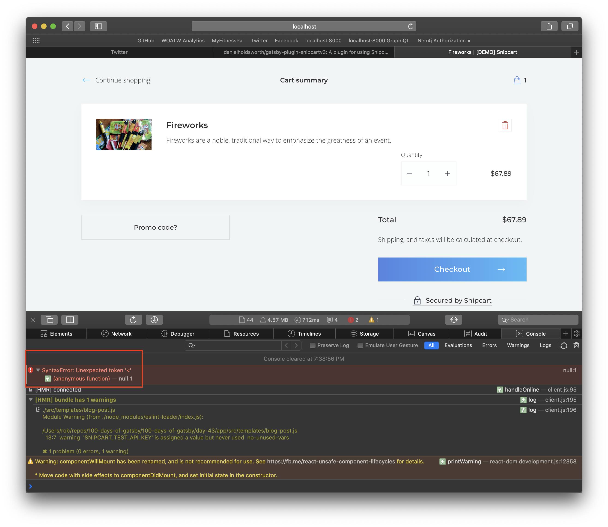
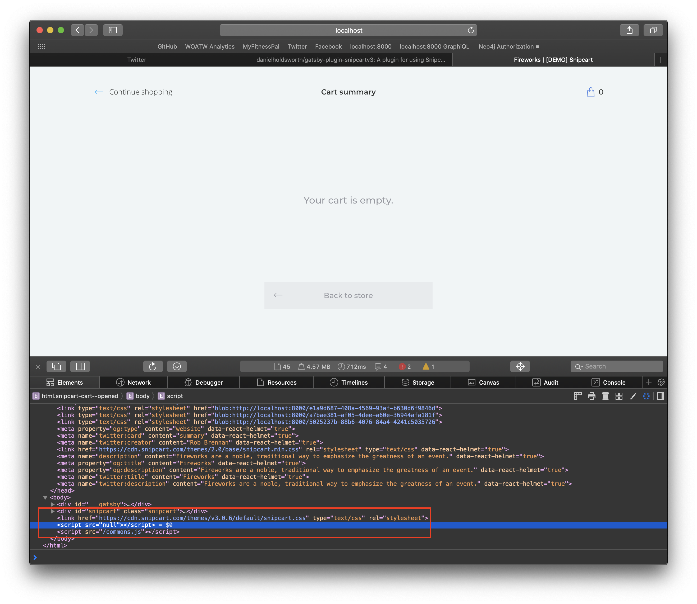

# Day 44 - Thursday, February 13th, 2020

After exploring [gatsby-plugin-snipcartv3](https://www.npmjs.com/package/gatsby-plugin-snipcartv3), I discovered a minor issue where deliberately excluding jQuery resulted in the plug-in trying to load a `null` script - which resulted in console errors in the browser:

I sent a friendly follow up to the plug-in developer, and was pleasantly surprised to receive an email today with the fix in place.

Today's focus will be seeing if the issue reported is fixed 🤓
