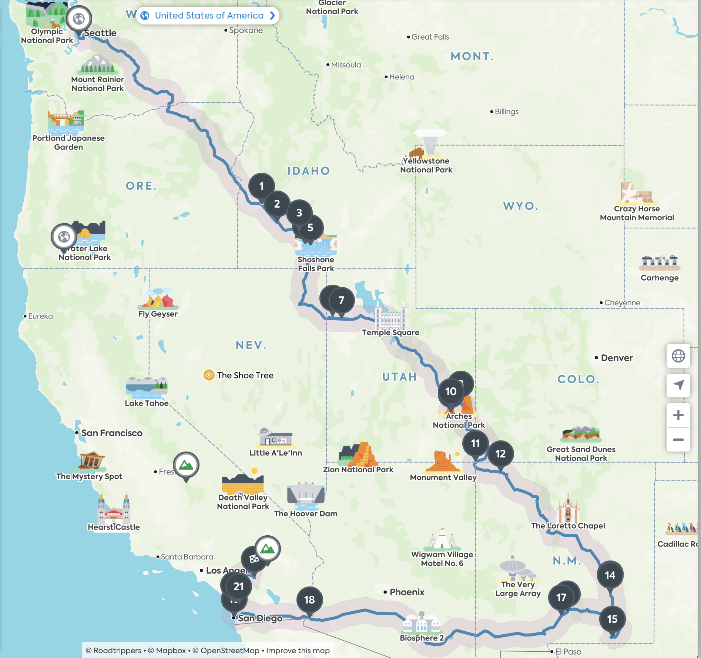
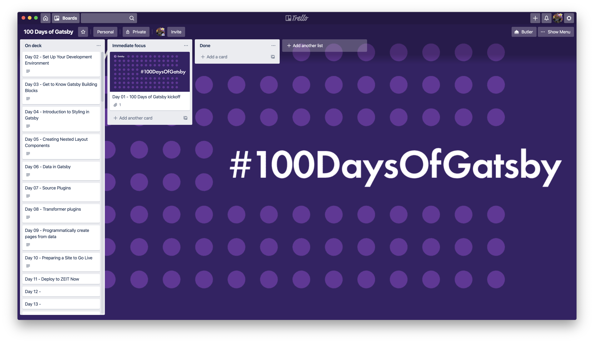

# Welcome

This repo has been created to store my thoughts and ideas for exploring [100 Days Of Gatsby - Our Guided Coding Challenge for 2020](https://www.gatsbyjs.org/blog/100days/)

Follow the discussion on Twitter with the hashtag [#100DaysOfGatsby](https://twitter.com/search?q=%23100DaysOfGatsby)

## #100DaysOfGatsby Challenge #1: Track Your Progress with a Blazing Fast Blog

For the first week, Gatsby suggested exploring the [Gatsby.js Tutorials](https://www.gatsbyjs.org/tutorial/) and complete lessons 0-8.

### Day 01 - Wednesday, January 1st, 2020

I'm pretty stoked about committing to #100DaysOfGatsby - however my biggest challenge is that I am **3053.1** miles deep into a road trip:



Previously, I have dabbled around a bit with Gatsby - creating an example repo to develop Gatsby sites using [Docker](https://www.docker.com/) at [https://github.com/TheRobBrennan/explore-docker-gatsby](https://github.com/TheRobBrennan/explore-docker-gatsby)

Given that I will be on the road over the next few days, my goals are to review the [suggested Gatsby.js lessons](https://www.gatsbyjs.org/tutorial/).

While I do have some experience working with Gatsby, this will help buy time on the road.

Tonight's accomplishment will have to be creating this document as well as a Trello board for tracking ideas and progress:



### Day 02 - Thursday, January 2nd, 2020

Today's focus is on the tutorial [Set Up Your Development Environment](https://www.gatsbyjs.org/tutorial/part-zero/).

As a personal preference, I love developing my applications using Docker. This enables me to ensure a consistent environment for development and release.

This example is intended to work with [Docker](https://www.docker.com) and a new app generated by the [Gatsby CLI](https://www.gatsbyjs.com).


```sh
# Navigate to the appropriate example directory
$ cd examples/day-02-gatsby-new

# Launch the Dockerized project
$ npm start # Or "npm run build"

You can now view gatsby-starter-default in the browser.
⠀
  Local:            http://localhost:8000/
  On Your Network:  http://172.20.0.2:8000/
⠀
View GraphiQL, an in-browser IDE, to explore your site\'s data and schema
⠀
  Local:            http://localhost:8000/___graphql
  On Your Network:  http://172.20.0.2:8000/___graphql
⠀
Note that the development build is not optimized.

# When you are ready to spin down the Dockerized project, press CTRL+C and then...
$ npm stop

Removing gatsby-day-02 ... done
Removing network day-02-gatsby-new_default
```

#### TL:DR Generate a new Gatsby site

To create a new Gatsby app, I will use `npx` to create a new [Gatsby](https://www.gatsbyjs.com) app using the latest version of the [Gatsby CLI](https://www.gatsbyjs.com):

```sh
# Navigate to the appropriate example directory
$ cd examples/day-02-gatsby-new

# Generate a new app using the latest version of the Gatsby CLI
$ npx gatsby new app
```
